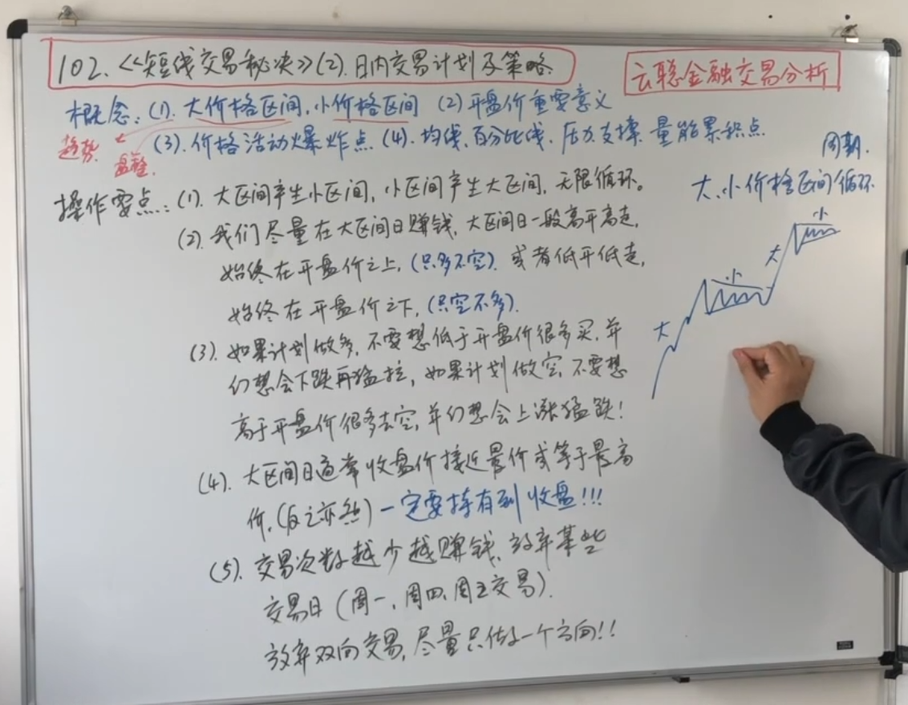
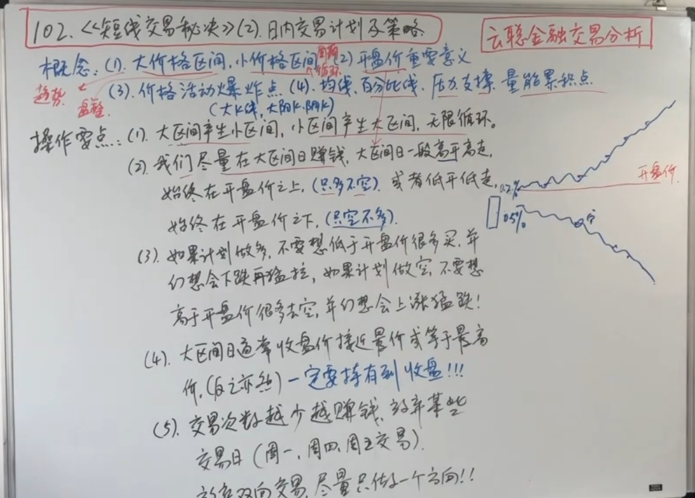

# 短线交易秘诀

## 拉瑞威廉姆斯介绍及其理念

核心：
1. 单纯关注价格(不关注指标、形态、量)
2. 做减法

理念：
1. 价值就是市场原因支付的价格，价值无常（经常变）
2. 熬过最难的日子 -> 资金管理
3. 我们无法预见价格变动，但可以学会控制自己的损失
4. 市场永远在变化，我们要学会适应市场
5. 专注、果断开仓
6. 我认为我现在做的每一笔交易都会亏损，而且亏的很大（止损）

毫无意外的小亏损 + 意外的大盈利 + 毫无意外的成功止损 = 赢家

## 大小区间，开盘价，价格爆炸点等日内交易重要理念

概念：
1. 大价格区间（趋势）、小价格区间（震荡）
    - 它认为时间循环是不存在的，只存在大小价格区间循环
    - 一阵大区间后，会有一阵小区间（可能向上也可能向下，不管怎么样，后面会出一个新的趋势），即趋势-盘整-趋势-盘整

2. 开盘价重要意义
    - 开盘价可以看作生死线，是多空分水线

3. 价格活动爆炸点
    - 如果一个大区间变成小区间后，突然价格向一个方向爆炸，那么这个点就是价格爆炸点，这时要向爆炸方向开仓

4. 均线、百分比线、压力线、支撑线、量能累积点

方向是资金流决定的，不是技术分析决定的。

操作要点：

1. 大区间产生小区间，小区间产生大区间，无限循环
2. 我们尽量在大区间赚钱
    - 如何判断是大区间：大区间一般高开高走，始终在开盘价之上（只多不空） 或者 低开低走，始终在开盘价之下（只空不多）
3. 如果计划做多，不要想低于开盘价很多买，并幻想会下跌再猛拉；如果计划做空，不要想高于开盘价很多去空，并幻想会上涨再猛跌（说明是小区间、可以放弃）。
4. 大区间日通常收盘价接近或等于最高价（反之亦然），一定要持有到收盘
5. 交易次数越少，越容易赚钱，放弃某些交易日（周一、周四、周五）
    - 放弃双向交易，尽量只做一个方向

总结：

- 不要想着涨和跌，只要想着大区间和小区间（有行情或没行情），开盘价决定了你的方向。
- 做大区间，不做小区间

## 如何做完整的日内交易计划

