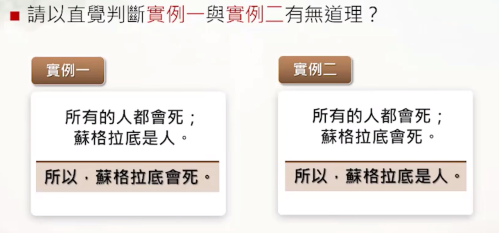

# 逻辑学

## 1.什么是逻辑

### 1.1 逻辑：道理、原理、logos

怎么样思考才有道理？

## 1.2 逻辑的目标

## 参考

- [台湾中国文化大学公开课：《逻辑学》](https://www.bilibili.com/video/BV1kX4y1c7Zi/?spm_id_from=333.337.search-card.all.click&vd_source=8a44bd95e3b76d06cef51b8c376b78da)